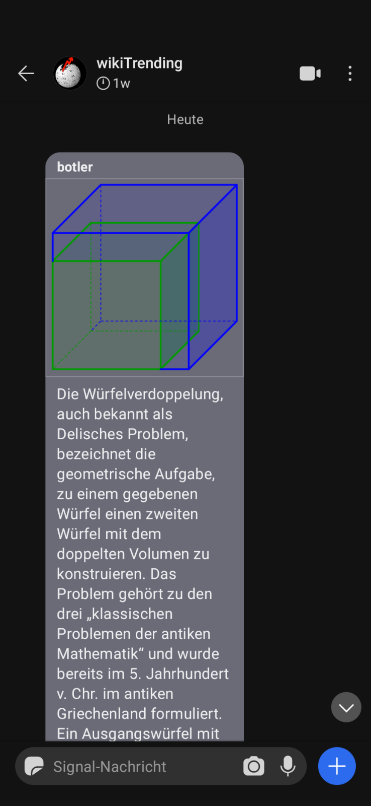

# wikiTrending

Signal-Bot that notifies about trending pages on Wikipedia.

Inspired by: https://www.youtube.com/watch?v=39nV7f3HZg0

## Background

It is an attempt to transform the [wikiTrending-bot](https://github.com/call-me-matt/wikiTrending) from Telegram to Signal.

## Installation

 - use signal-cli to create a new account or to link your account
 - create a group to send messages to
 - update the `docker-compose.yaml` with your profile data
 - start the bot with the command `docker-compose up`
 - you will be notified every day at the time you started the instance

## Known problems

 - if someone changes the phone, you might need to trust that device with signal-cli manually
 - consider also to use Telegram, where my bot is also available
